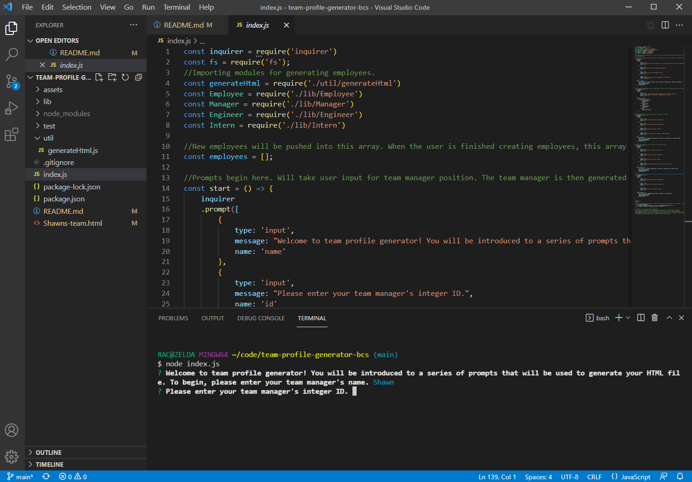

# team-profile-generator-bcs

## Description

Welcome to Team Profile Generator! This easy-to-use app will allow you to generate a tidy website that showcases your list of employees and their contact information. It runs in the command line and takes input from the user via a series of prompts. Using this app makes it easy to create a hub of information containing all of your employees' contact info, laid out in a nice and easy-to-read fashion. No longer will one have to sort through long, eyesore lists of dense text to find that hidden email or office number. Use this app to make your life better, faster, more efficient and ultimately, more professional.

## Installation

As this is a command line app, there are a couple of steps required to get it going. Please refer to my video below for a quick walkthrough on how to install the app:

[https://www.youtube.com/watch?v=Y57TBt4clnI]

## Usage

Using the app is as simple as answering the prompts given in the command line. Initialize the app by entering 'node index.js' into the terminal. The prompts will appear and then you just need to type in your answers to the prompts and hit 'enter.' To navigate through your choices, use the arrow keys, and hit 'enter' to make your selection.

## How to Contribute

If you have any questions or concerns, please don't hesitate to contact me via email:
(shawnanalla@gmail.com)

## Credits

[https://www.npmjs.com/package/jest]
[https://www.npmjs.com/package/inquirer]

## License

MIT License

Copyright (c) [2022] [Shawn Analla]

Permission is hereby granted, free of charge, to any person obtaining a copy
of this software and associated documentation files (the "Software"), to deal
in the Software without restriction, including without limitation the rights
to use, copy, modify, merge, publish, distribute, sublicense, and/or sell
copies of the Software, and to permit persons to whom the Software is
furnished to do so, subject to the following conditions:

The above copyright notice and this permission notice shall be included in all
copies or substantial portions of the Software.

THE SOFTWARE IS PROVIDED "AS IS", WITHOUT WARRANTY OF ANY KIND, EXPRESS OR
IMPLIED, INCLUDING BUT NOT LIMITED TO THE WARRANTIES OF MERCHANTABILITY,
FITNESS FOR A PARTICULAR PURPOSE AND NONINFRINGEMENT. IN NO EVENT SHALL THE
AUTHORS OR COPYRIGHT HOLDERS BE LIABLE FOR ANY CLAIM, DAMAGES OR OTHER
LIABILITY, WHETHER IN AN ACTION OF CONTRACT, TORT OR OTHERWISE, ARISING FROM,
OUT OF OR IN CONNECTION WITH THE SOFTWARE OR THE USE OR OTHER DEALINGS IN THE
SOFTWARE.